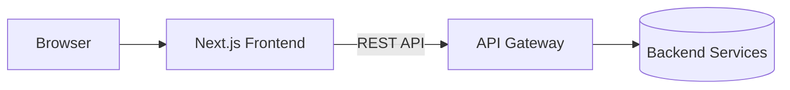

# Motzkin Store Web

A modern, responsive web application for school equipment management built with **Next.js 16**, **TypeScript**, and **Tailwind CSS**.

This is the **frontend component** of the Motzkin Store system. It provides the user interface for browsing school equipment catalogs, managing shopping carts, and handling user authentication.

---

## Screenshots

<!-- Uncomment and update paths when screenshots are available -->
<!--
| Home Page | Equipment Selection |
|:---------:|:-------------------:|
|  |  |

| Shopping Cart | Login Page |
|:-------------:|:----------:|
|  |  |
-->

*Screenshots coming soon.*

---

## Table of Contents

- [Features](#features)
- [Architecture](#architecture)
- [Tech Stack](#tech-stack)
- [Getting Started](#getting-started)
  - [Prerequisites](#prerequisites)
  - [Installation](#installation)
  - [Environment Variables](#environment-variables)
- [Development](#development)
- [Docker](#docker)
  - [Development Mode](#development-mode)
  - [Production Mode](#production-mode)
- [Project Structure](#project-structure)
- [API Integration](#api-integration)
- [Available Scripts](#available-scripts)
- [Additional Documentation](#additional-documentation)
- [License](#license)

---

## Features

| Feature | Description |
|---------|-------------|
| **School Equipment Catalog** | Browse and select equipment organized by school and grade level |
| **Shopping Cart** | Add, remove, and modify item quantities with persistent cart state |
| **Authentication** | Session-based authentication with protected routes |
| **Protected Routes** | Automatic redirection for unauthenticated users |
| **Dark Mode** | Built-in dark mode support via Tailwind CSS |
| **Responsive Design** | Mobile-first layout that adapts to all screen sizes |

---

## Architecture

This frontend is one component of the Motzkin Store system. It communicates with the backend API Gateway via REST.



For the full system architecture, see the main project repository.

---

## Tech Stack

| Technology | Version | Purpose |
|------------|---------|---------|
| [Next.js](https://nextjs.org/) | 16.x | React framework with App Router for server-side rendering and routing |
| [React](https://react.dev/) | 19.x | Component-based UI library |
| [TypeScript](https://www.typescriptlang.org/) | 5.x | Static type checking for improved developer experience |
| [Tailwind CSS](https://tailwindcss.com/) | 4.x | Utility-first CSS framework for rapid styling |

---

## Getting Started

### Prerequisites

Before you begin, ensure you have the following installed:

| Requirement | Version | Notes |
|-------------|---------|-------|
| Node.js | 20.x or later | [Download here](https://nodejs.org/) |
| npm | 10.x or later | Included with Node.js |

### Installation

1. **Clone the repository**

   ```bash
   git clone <repository-url>
   cd Front-End
   ```

2. **Install dependencies**

   ```bash
   npm install
   ```

3. **Configure environment variables**

   Copy the example environment file and configure it:

   ```bash
   cp .env.example .env.local
   ```

   Edit `.env.local` with your backend API URL. See [Environment Variables](#environment-variables) for details.

4. **Start the development server**

   ```bash
   npm run dev
   ```

5. **Open in browser**

   Navigate to [http://localhost:3000](http://localhost:3000)

### Environment Variables

Environment variables are managed through `.env.local` (local development) or passed via Docker/deployment configuration.

| Variable | Required | Description | Default |
|----------|----------|-------------|---------|
| `NEXT_PUBLIC_API_URL` | Yes | Base URL of the backend API Gateway | `http://localhost:8080` |

> **Note:** Variables prefixed with `NEXT_PUBLIC_` are exposed to the browser. Never store sensitive secrets in these variables.

---

## Development

### Local Development

```bash
# Start development server with hot reload
npm run dev

# Run linter to check code quality
npm run lint

# Build for production (local testing)
npm run build

# Start production server locally
npm start
```

### Code Style

The project uses ESLint with the Next.js configuration. Run `npm run lint` before committing to ensure code quality.

---

## Docker

The project includes a multi-stage Dockerfile optimized for both development and production environments. See [docs/docker.md](./docs/docker.md) for detailed Docker documentation.

### Development Mode

Development mode enables hot reload by mounting your source code as a volume:

```bash
# Build the development image
docker build --target development -t motzkin-web:dev .

# Run with volume mount for hot reload
docker run -p 3000:3000 -v ${PWD}/src:/app/src motzkin-web:dev
```

**Windows PowerShell:**
```powershell
docker run -p 3000:3000 -v ${PWD}/src:/app/src motzkin-web:dev
```

**Windows Command Prompt:**
```cmd
docker run -p 3000:3000 -v %cd%/src:/app/src motzkin-web:dev
```

### Production Mode

Production mode creates an optimized, minimal image using Next.js standalone output:

```bash
# Build the production image
docker build --target production -t motzkin-web:prod .

# Run the production container
docker run -p 3000:3000 -e NEXT_PUBLIC_API_URL=https://api.example.com motzkin-web:prod
```

### Docker Compose

For full-stack development with all backend services, use Docker-Compose from the main project repository. This handles networking, environment variables, and service orchestration automatically.

---

## Project Structure

```
src/
├── app/                        # Next.js App Router
│   ├── layout.tsx              # Root layout with global providers
│   ├── page.tsx                # Home page (equipment selection)
│   ├── globals.css             # Global styles and Tailwind imports
│   ├── about/
│   │   └── page.tsx            # About page
│   ├── cart/
│   │   └── page.tsx            # Shopping cart page
│   └── login/
│       └── page.tsx            # Authentication page
│
├── components/                 # Reusable React components
│   ├── Header.tsx              # Navigation header with auth status
│   ├── Footer.tsx              # Page footer
│   ├── Layout.tsx              # Page layout wrapper
│   ├── EquipmentList.tsx       # Equipment display with selection
│   ├── SearchableSelect.tsx    # Dropdown with search filtering
│   ├── SaveToCartButton.tsx    # Cart submission button
│   ├── ConfirmDialog.tsx       # Confirmation modal
│   ├── Toast.tsx               # Notification component
│   ├── LoginForm.tsx           # Authentication form
│   ├── ProtectedRoute.tsx      # Route guard for auth
│   └── AuthenticatedProviders.tsx  # Providers for authenticated users
│
├── contexts/                   # React Context providers
│   ├── AuthContext.tsx         # Authentication state management
│   └── CartContext.tsx         # Shopping cart state management
│
├── services/                   # API integration layer
│   └── api.ts                  # Backend API client functions
│
└── types/                      # TypeScript type definitions
    └── cart.ts                 # Cart-related interfaces
```

---

## API Integration

The frontend communicates with the backend through a centralized API service (`src/services/api.ts`). All API calls:

- Use the `NEXT_PUBLIC_API_URL` environment variable as the base URL
- Include credentials for session-based authentication
- Handle errors consistently with user-friendly messages

### Endpoints Used

| Endpoint | Method | Description |
|----------|--------|-------------|
| `/api/login` | POST | User authentication |
| `/api/logout` | POST | Session termination |
| `/api/auth/status` | GET | Check authentication status |
| `/api/schools` | GET | Fetch available schools |
| `/api/grades` | GET | Fetch grades for a school |
| `/api/equipment` | GET | Fetch equipment for a grade |
| `/api/cart` | GET/POST | Retrieve or update user cart |

For complete API documentation, see the backend repository.

---

## Available Scripts

| Command | Description |
|---------|-------------|
| `npm run dev` | Start development server with hot reload on port 3000 |
| `npm run build` | Create optimized production build |
| `npm start` | Start production server (requires `npm run build` first) |
| `npm run lint` | Run ESLint to check for code quality issues |

---

## Additional Documentation

| Document | Description |
|----------|-------------|
| [Docker Guide](./docs/docker.md) | Detailed Docker setup and troubleshooting |

---

## License

This project is licensed under the Apache License 2.0. See [LICENSE](LICENSE) for details.
